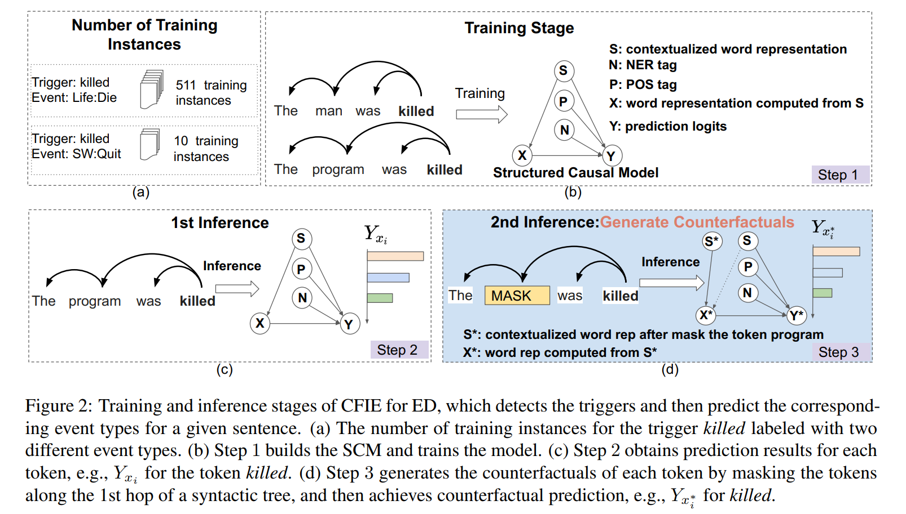
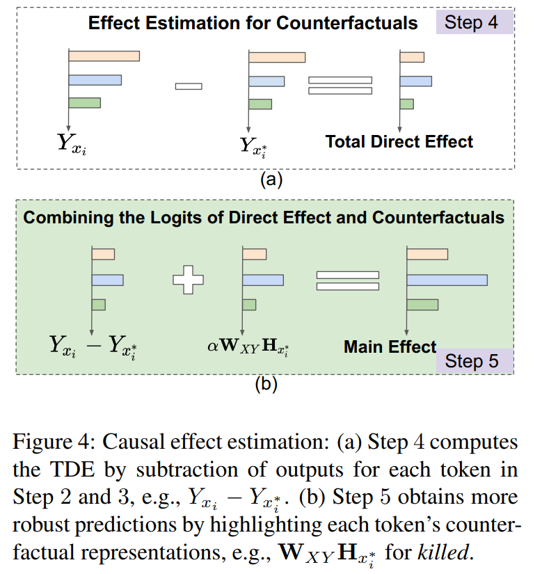
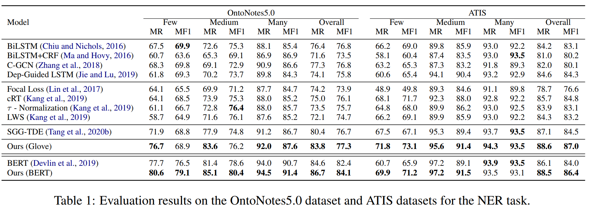
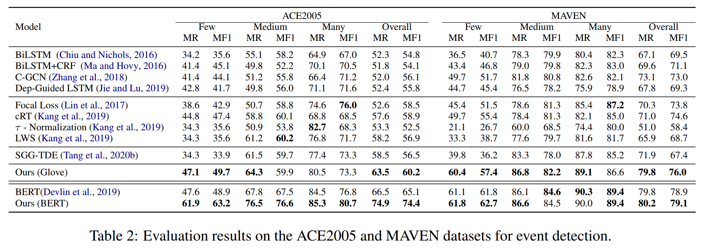
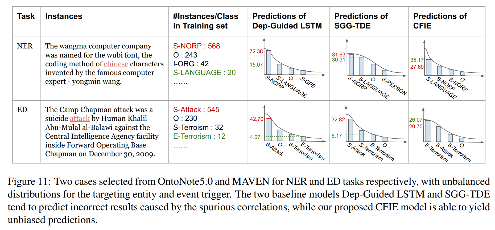

UNCOVERING MAIN CAUSALITIES FOR LONG-TAILED INFORMATION EXTRACTION 
==========

This repo contains the *PyTorch* code for our proposed CFIE in EMNLP 2021 paper "Uncovering Main Causalities for Long-tailed Information Extraction".

## Overview of CFIE

### Abstract

Information Extraction (IE) aims to extract structural information from unstructured texts. In practice, long-tailed distributions caused by the selection bias of a dataset, may lead to spurious correlations between entities and labels in the conventional likelihood models. This motivates us to propose counterfactual IE (CFIE), a novel framework that aims to uncover the main causalities behind data in the view of causal inference. Specifically, 1) we first introduce a unified structural causal model (SCM) for various IE tasks, describing the relationships among variables; 2) with our SCM, we then generate counterfactuals based on an explicit language structure to better calculate the direct causal effect during the inference stage; 3) we further propose a novel debiasing approach to yield more robust predictions. Experiments on three IE tasks across five public datasets show the effectiveness of our CFIE model in mitigating the spurious correlation issues.

### Framework





### Results for NER



### Results for event detection



### Case study



## Requirements

- Python 3 (tested on 3.6.5)
- PyTorch (> 1.0)
- tqdm
- numpy


## Training

To train a baseline Dep-guided LSTM model, run:
```python
python train.py --id 0 --seed 0 --effect_type None --lr 0.001 --num_epoch 1000 --data_dir dataset/atis --vocab_dir dataset/atis 
```

To train CAUSAL model with based on a predefined casual graph, run:
```python
python train.py --id 1 --seed 0 --effect_type CAUSAL --lr 0.001 --num_epoch 1000 --data_dir dataset/atis --vocab_dir dataset/atis 
```

Model checkpoints and logs will be saved to `./saved_models/00`.

Model checkpoints and logs will be saved to `./saved_models/01`.

For details on the use of other parameters, please refer to `train.py`.

## Evaluation

For Dep-guided LSTM model, run:

```python
python eval.py --model_dir saved_models/00 --data_dir dataset/atis --dataset test --effect_type None
```
For the CAUSAL model:

1. To find the optimal value of alpha on dev set, you can try different values, e.g. 

   ```python
   python eval.py --model_dir saved_models/01 --data_dir dataset/atis --dataset dev --effect_type CAUSAL --alpha 1.2
   ```

   We observe that the optimal value of alpha is around 1.2. 

2.  Run the model on test set by 

   ```python
   python eval.py --model_dir saved_models/01 --data_dir dataset/atis --dataset test --effect_type CAUSAL --alpha 1.2
   ```

This will use the `best_model.pt` file by default. Use `--model checkpoint_epoch_10.pt` to specify a model checkpoint file.


## Notice

Due to copyright issues, we only include ATIS dataset here. 

We provide the trained glove embeddings. Here we use glove.840B.300d.txt (https://nlp.stanford.edu/projects/glove/). You can also modify settings in prepare_vocab.py and generate different embeddings.

We also release a version of pretrained model for ATIS dataset. (saved_models/02) 

You can run the following command to reproduce similar results.

```python
python eval.py --model_dir saved_models/02 --data_dir dataset/atis --dataset test --effect_type CAUSAL --alpha 1.2
```

